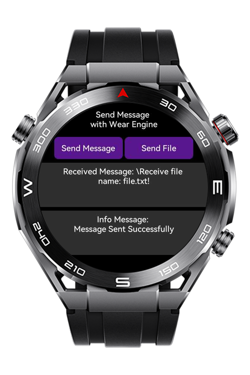

> **Note:** To access all shared projects, get information about environment setup, and view other guides, please visit [Explore-In-HMOS-Wearable Index](https://github.com/Explore-In-HMOS-Wearable/hmos-index).

# [Mobile - Lite Wearable] WearEngine Message & File Send/Receiver

This app shows how to use the Huawei Wear Engine SDK. 
It helps an Android phone talk to a Huawei Sport Watch (Lite Wearable). 
The app can send and receive messages and file between the phone and the watch.

# Preview
<div>
    
    
</div>

# Use Cases

- Send text messages from watch to phone
- Transfer files from watch to mobile device
- Receive messages from paired phones
- Handle incoming files on wearable devices
- Device pairing and connection management

# Technology

## Stack

- Languages: JavaScript (Huawei LiteWearable)
- Tools: Android Studio, Huawei DevEco IDE
- Libraries: Wear Engine SDK (Huawei P2P Messaging, Huawei P2P Receive File & Message)

## Documentation Link
- [Applying for the Wear Engine Service](https://developer.huawei.com/consumer/en/doc/connectivity-Guides/applying-wearengine-0000001050777982)
- [Wear Engine SDK](https://developer.huawei.com/consumer/en/doc/connectivity-Library/litewearable-sdk-cn-0000001705004353)
- [Lite Wearable App Development via Wear Engine](https://developer.huawei.com/consumer/en/doc/connectivity-Guides/fitnesswatch-dev-0000001051423561)

# Directory Structure
```
└───main
│   config.json
│
├───js
│   └───MainAbility
│       │   app.js
│       │
│       ├───constants
│       │       constants.js
│       │
│       ├───i18n
│       │       en-US.json
│       │       zh-CN.json
│       │
│       ├───pages
│       │   ├───index
│       │   │       index.css
│       │   │       index.hml
│       │   │       index.js
│       │   │
│       │   └───mainPage
│       │           mainPage.css
│       │           mainPage.hml
│       │           mainPage.js
│       │
│       ├───utils
│       │       utils.js
│       │
│       └───wearengine
│               wearengine.js
│               wearengine.js.sha256
│
└───resources
├───base
│   ├───element
│   │       string.json
│   │
│   └───media
│           icon.png
│           icon_small.png
│
└───rawfile
file.txt
```
# Constraints and Restrictions
## Supported Devices 
- Huawei Sport (Lite) Watch GT 4/5 
- Huawei Sport (Lite) GT4/5 Pro
- Huawei Sport (Lite) Fit 3/4
- Huawei Sport (Lite) D2
- Huawei Sport (Lite) Ultimate

## Requirements
1. **Huawei DevEco IDE**: Required for developing the Huawei watch app.
2. After downloading the wear engine file from the [document (click to visit download page)](https://developer.huawei.com/consumer/en/doc/connectivity-Library/litewearable-sdk-cn-0000001705004353), 
place it in  ```\entry\src\main\js\MainAbility\wearengine``` directory.
3. Set signing configs and PEER_PKG_NAME & PEER_FINGERPRINT in utils.
4. Build and run the app on a **Huawei lite wearable**.
5. Ensure the **sport watch** and **mobile app** are properly paired.

# LICENSE
[Mobile - Lite Wearable] WearEngine Message & File Send/Receiver is distributed under the terms of the MIT License.
See the [license](/LICENSE) for more information.